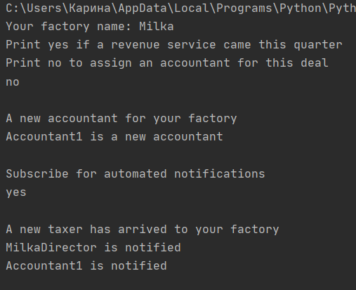

# ***TMPS Laboratory Work #3***
# ***Behavioral Design Patterns***

### Author: Constantinova Carina
----

## Objectives:

* Get familiar with the Behavioral Design Patterns;
* As a continuation of the previous laboratory work, think about what communication between software entities might be involed in my system;
* Implement some additional functionalities using behavioral design patterns;

## Behavioral Design Pattern:
 - [ ] Command
 - [ ] Interpreter
 - [ ] Iterator
 - [ ] Mediator
 - [x] Publisher
 - [ ] Strategy

## Implementation:
#### Observer
The observer pattern is a software design pattern in which an object, called the subject or observable, manages a list of dependents, called observers, and notifies them automatically of any internal state changes, and calls one of their methods.
There are created two classes:
```python 
class Subscriber(ABCMeta):
    @abstractmethod
    def attach(self, publisher: Publisher):
        pass

    @abstractmethod
    def detach(self, publisher: Publisher):
        pass

    @abstractmethod
    def notify(self):
        pass


class Publisher(ABCMeta):
    @abstractmethod
    def update(self, subscriber: Subscriber):
        pass
```
The classical ones: Observable(Subscriber) and Observers(Publisher)

## How it works for my system
Previously, I have implemented Chocolate Factory and Stores where all the products are created, stored, and sold in Creational DP. Later, there was also implemented Bussiness Model for the owners of the factory and stores in Structural DP. Now I added to CDP a notifiying system, where the accountants of the business are created, notified when the revenue service comes and when it is needed to pay the bills in the file factory_check.py : 
```python
def notify(self, event):
        print("Subject: Notifying accountants...\n")
        for publisher in self._publishers:
            publisher.update(event)

    def new_taxer(self, taxer):
        print("A new taxer has arrived to your factory")
        self.taxers.append(taxer)
        event = taxer.factory + " have come with new revenue checks\n" #a taxer
        self.notify(event)

    def new_manager(self, accountant):
        print("A new accountant for your factory")
        self.accountants.append(accountant)
        event = accountant.factory + " is a new accountant\n" #created an accountant
        self.notify(event)
```
Here is the process how a factory director is notified of current events in owner.py:
```python
from behavioral.abstractions.publisher import Publisher
from creational.builder import MilkaDirector


class Owner(Publisher):
    factory: object

    def __init__(self) -> object:
        self.factory = MilkaDirector

    def update(self, subscriber):
        print("The " + self.factory + " was notified. " + subscriber)
```
The result:



## Conclusion
The Observer pattern has many advantages and benefits:
The Observer pattern lets you vary subjects and observers independently. You can reuse subjects without reusing their observers, and vice versa. It lets you add observers without modifying the subject or other observers.
*Supports Broadcast Messages.

Unlike an ordinary request, the notification that a subject sends needn't specify its receiver. The notification is broadcast automatically to all interested objects that subscribed to it. The subject doesn't care how many interested objects exist; its only responsibility is to notify its observers. This gives you the freedom to add and remove observers at any time. It's up to the observer to handle or ignore a notification.

*Notification system can be 2 ways: 
a. We can have state-setting operations on Subject call Notify after they change the subject's state. The advantage of this approach is that clients don't have to remember to call Notify on the subject. The disadvantage is that several consecutive operations will cause several consecutive updates, which may be inefficient.

b. We can make clients responsible for calling Notify at the right time in our programs. The advantage here is that the client can wait to trigger the update until after a series of state changes has been made, thereby avoiding needless intermediate updates. The disadvantage is that clients have an added responsibility to trigger the update. That makes errors more likely, since clients might forget to call Notify.
